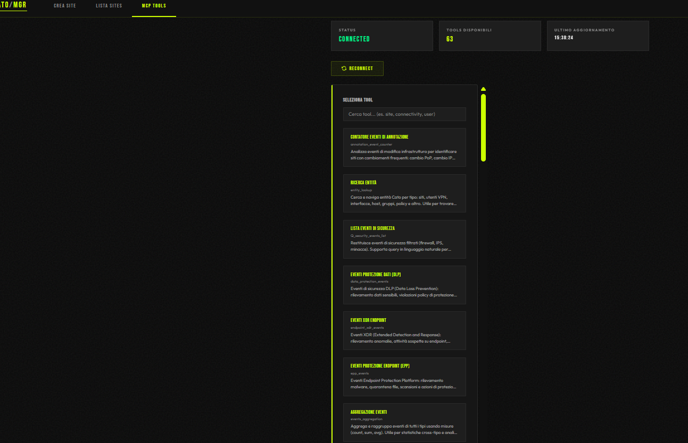

# MCP-Cato

**Cato Networks SASE/SD-WAN management webapp powered by Model Context Protocol (MCP) and AI agents.**

A full-stack web application that integrates with Cato Networks' API through both GraphQL and MCP (Model Context Protocol), providing a unified management interface with 63 operational tools and AI-powered agent orchestration.



---

## English

### Overview

MCP-Cato bridges Cato Networks' SASE platform with a modern web interface, enabling network administrators to manage sites, users, security policies, and run diagnostics through an intuitive dashboard. The backend connects to Cato's API via two channels:

- **GraphQL Direct** — Site creation, VLAN configuration, location lookup
- **MCP SDK** — 63 operational tools covering security events, user management, network analytics, and more

### Architecture

```
┌─────────────────────────────────────────────────────┐
│                    Frontend (Nginx)                   │
│          180KB inline HTML — Dark Athletic Luxury     │
│     ┌──────────┬──────────┬──────────────────┐       │
│     │ Site Mgmt│ User Dir │   63 MCP Tools   │       │
│     └──────────┴──────────┴──────────────────┘       │
│                        │ /api/*                       │
├────────────────────────┼────────────────────────────-─┤
│                  Backend (Express)                     │
│              ┌─────────┴──────────┐                   │
│         GraphQL Client       MCP Client               │
│              │                    │                    │
│    Cato GraphQL API      Cato MCP Server              │
└─────────────────────────────────────────────────────-─┘
```

**Stack:**
- **Backend**: Node.js 20 + Express + MCP SDK + graphql-request
- **Frontend**: Single-file HTML with inline CSS/JS (no build step)
- **Infrastructure**: Docker Compose (nginx + node containers)
- **Design**: Dark Athletic Luxury (Bebas Neue + Outfit, lime/black palette)

### MCP Tools (63 total)

| Category | Count | Examples |
|----------|-------|---------|
| Security Events | 16 | Firewall events, threat detection, DLP, XDR, EPP |
| Site & WAN | 12 | Metrics, diagnostics, connectivity, bandwidth |
| User & Group Management | 12 | Directory, groups, membership, group details |
| Analytics | 7 | App stats, connectivity stats, hardware stats (with timeseries) |
| VPN Users | 6 | Metrics, connection metadata, last mile diagnostics |
| Security Posture | 5 | Summary, daily trends, check results, compliance frameworks |
| Account Snapshots | 2 | Connected sites, user overview |
| Knowledge Base | 2 | GraphQL API docs, Cato KB search |
| Infrastructure | 2 | Entity lookup, annotation events |

### Key Features

- **Auto-pagination**: User directory queries automatically paginate beyond the 500-record API limit, returning all users in a single response
- **Group enrichment**: Group detail queries are automatically enriched with real member counts and member lists (the Cato API returns 0 for member count by default)
- **Italian UI**: All 63 tools have Italian names and descriptions with a searchable interface
- **Smart result rendering**: Results are displayed as formatted tables with action badges, CSV export, and partial result warnings
- **Site creation wizard**: Multi-step site creation with native network, VLAN configuration, and DHCP settings

### Quick Start

```bash
# 1. Clone the repository
git clone https://github.com/mmereu/MCP-Cato.git
cd MCP-Cato

# 2. Configure environment
cp backend/.env.example backend/.env
# Edit backend/.env with your Cato API key and account ID

# 3. Start with Docker Compose
docker compose up -d --build

# 4. Open http://localhost:8080
```

### Environment Variables

| Variable | Description |
|----------|-------------|
| `CATO_API_KEY` | Your Cato Networks API key |
| `CATO_ACCOUNT_ID` | Your Cato account ID |
| `CATO_ENDPOINT` | GraphQL endpoint (default: `https://api.catonetworks.com/api/v1/graphql2`) |
| `PORT` | Backend port (default: `3001`) |

### API Endpoints

| Endpoint | Method | Description |
|----------|--------|-------------|
| `/api/mcp/status` | GET | MCP connection status |
| `/api/mcp/tools` | GET | List all 63 available tools |
| `/api/mcp/call` | POST | Execute any MCP tool |
| `/api/mcp/reconnect` | POST | Reconnect MCP client |
| `/api/sites` | GET | List all sites |
| `/api/sites/create-complete` | POST | Create site with VLANs |
| `/api/locations` | GET | Location lookup |
| `/api/health` | GET | Health check |

### AI Agents

The `agents/` directory contains configurations for AI agent orchestration:

- **`agents/swarm/`** — Universal multi-agent system with 18 specialized subagents (coder, debugger, architect, security, tester, React/Vue/Angular specialists, etc.)
- **`agents/cato/`** — 5 Cato-specific agents: Security Analyst, Network Engineer, Data Analyst, Incident Responder, Operator

### Project Structure

```
MCP-Cato/
├── docker-compose.yml          # Container orchestration
├── backend/
│   ├── Dockerfile              # Node.js 20 Alpine
│   ├── server.js               # Express server (327 lines)
│   ├── .dockerignore           # Excludes .env from image
│   └── .env.example            # Environment template
├── frontend/
│   ├── Dockerfile              # Nginx Alpine (no build step)
│   ├── index.html              # Full app (180KB, inline)
│   └── nginx.conf              # Reverse proxy + SPA
└── agents/
    ├── swarm/                  # 18 universal subagents
    └── cato/                   # 5 Cato-specific subagents
```

---

## Italiano

### Panoramica

MCP-Cato collega la piattaforma SASE di Cato Networks con un'interfaccia web moderna, permettendo agli amministratori di rete di gestire siti, utenti, policy di sicurezza e diagnostica attraverso una dashboard intuitiva. Il backend si connette all'API Cato tramite due canali:

- **GraphQL Diretto** — Creazione siti, configurazione VLAN, lookup location
- **MCP SDK** — 63 tool operativi per eventi sicurezza, gestione utenti, analytics di rete e altro

### Tool MCP (63 totali)

| Categoria | Quantità | Esempi |
|-----------|----------|--------|
| Eventi di Sicurezza | 16 | Firewall, threat detection, DLP, XDR, EPP |
| Siti e WAN | 12 | Metriche, diagnostica, connettività, banda |
| Gestione Utenti e Gruppi | 12 | Directory, gruppi, membership, dettagli gruppi |
| Analytics | 7 | Statistiche app, connettività, hardware (con serie temporali) |
| Utenti VPN | 6 | Metriche, metadati connessione, diagnostica last mile |
| Postura di Sicurezza | 5 | Riepilogo, trend giornalieri, check, framework compliance |
| Snapshot Account | 2 | Siti connessi, panoramica utenti |
| Knowledge Base | 2 | Documentazione GraphQL API, ricerca KB Cato |
| Infrastruttura | 2 | Ricerca entità, eventi di annotazione |

### Funzionalità Principali

- **Auto-paginazione**: Le query alla directory utenti paginano automaticamente oltre il limite di 500 record dell'API, restituendo tutti gli utenti in un'unica risposta
- **Arricchimento gruppi**: Le query di dettaglio gruppi vengono arricchite automaticamente con il conteggio reale dei membri e la lista completa (l'API Cato restituisce 0 per il conteggio membri di default)
- **Interfaccia in italiano**: Tutti i 63 tool hanno nome e descrizione in italiano con ricerca
- **Rendering risultati intelligente**: I risultati vengono mostrati come tabelle formattate con badge azioni, export CSV e avvisi risultati parziali
- **Wizard creazione siti**: Creazione siti multi-step con rete nativa, configurazione VLAN e impostazioni DHCP

### Avvio Rapido

```bash
# 1. Clona il repository
git clone https://github.com/mmereu/MCP-Cato.git
cd MCP-Cato

# 2. Configura l'ambiente
cp backend/.env.example backend/.env
# Modifica backend/.env con la tua API key e account ID Cato

# 3. Avvia con Docker Compose
docker compose up -d --build

# 4. Apri http://localhost:8080
```

### Agenti AI

La directory `agents/` contiene configurazioni per l'orchestrazione di agenti AI:

- **`agents/swarm/`** — Sistema multi-agente universale con 18 subagenti specializzati (coder, debugger, architect, security, tester, specialisti React/Vue/Angular, ecc.)
- **`agents/cato/`** — 5 agenti specifici Cato: Security Analyst, Network Engineer, Data Analyst, Incident Responder, Operator

---

## License

MIT

## Author

[@mmereu](https://github.com/mmereu)
